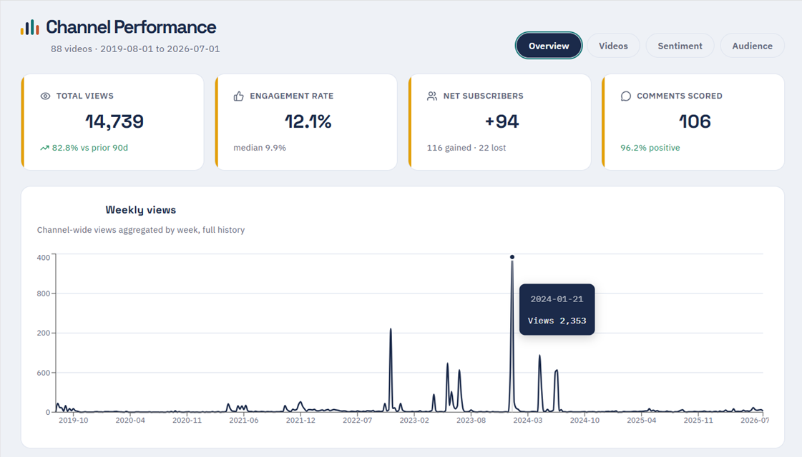
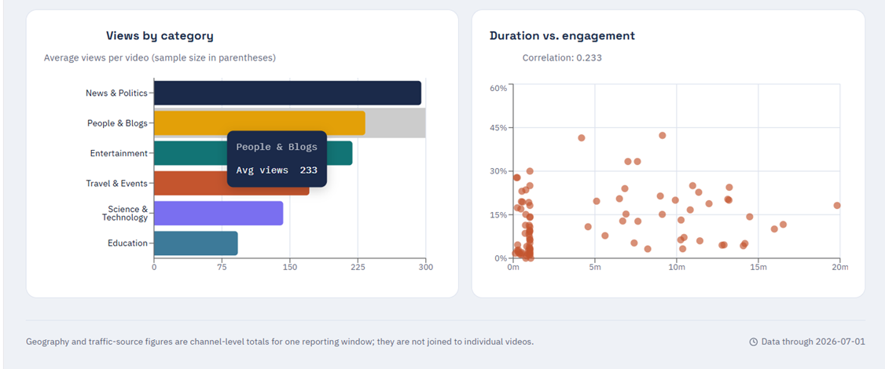
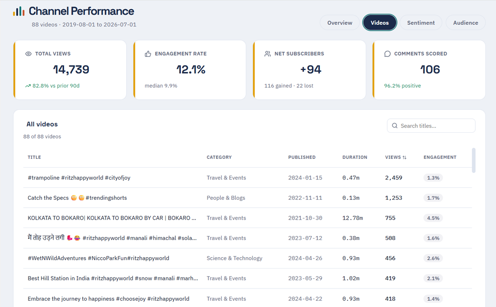
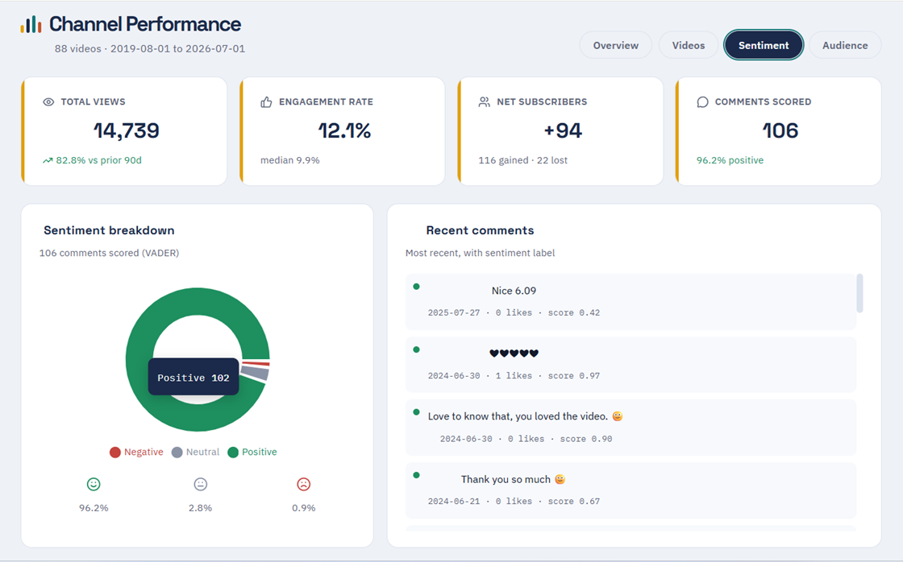
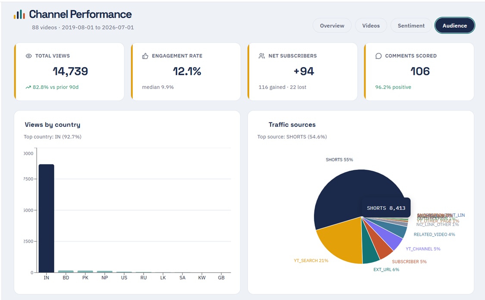

# YouTube Channel Performance Analytics

An end-to-end analysis of a YouTube channel's video performance, audience engagement,
and comment sentiment — built on the YouTube Data API and YouTube Analytics API.

### Domain : Social Media Analytics

**Live Dashboard:** [Click here](https://my-dashboard-iota-one.vercel.app)

---

## 📌 Table of Contents
- <a href="#overview">Project Overview</a>
- <a href="#key-findings">Key Findings</a>
- <a href="#tech-stack">Tech Stack</a>
- <a href="#getting-started">Getting Started</a>
- <a href="#project-structure">Project Structure</a>
- <a href="#report-pages">Report Pages</a>
- <a href="#dashboard-preview">Dashboard Preview</a>
- <a href="#priority-action-plan">Priority Action Plan</a>
- <a href="#author--contact">Author & Contact</a>

---

## 📊 What this project does

- Pulls video-level metrics (views, likes, comments, duration, category) via the
  YouTube Data API
- Pulls channel-level metrics (daily views, geography, traffic source, subscriber
  gain/loss) via the YouTube Analytics API
- Computes engagement rate, duration/engagement correlation, and recency effects
- Scores comment sentiment using VADER (lexicon-based sentiment analysis)
- Generates an executive summary report and an interactive dashboard

## 🔑 Key findings (88 videos analyzed)

- **14,739** total views, **12.06%** average engagement rate
- **+82.8%** view growth in the last 90 days vs. the prior 90
- **92.72%** of views come from a single country (India) — audience is concentrated
- **54.64%** of views come from YouTube Shorts — distribution depends on one surface
- **96.2%** of comments are positive (VADER sentiment, 106 comments scored)

See the full [Executive Summary](reports/Channel_Performance_Executive_Summary.pdf) for details.

## 🛠️ Tech stack

- Python (pandas, matplotlib, VADER/`vaderSentiment`)
- YouTube Data API v3
- YouTube Analytics API
- [Interactive dashboard link]

## 🚀 Getting started

\`\`\`bash
git clone https://github.com/<your-username>/youtube-channel-analytics.git
cd youtube-channel-analytics
pip install -r requirements.txt
\`\`\`

You'll need your own YouTube Data API key and OAuth credentials for the Analytics API.
Create a `.env` file:

\`\`\`
YOUTUBE_API_KEY=your_key_here
\`\`\`

Then run:

\`\`\`bash
python src/fetch_data.py
python src/analyze.py
\`\`\`

## 📁 Project structure

\`\`\`
├── src/            # data collection & analysis scripts
├── reports/        # generated executive summary
├── assets/charts/  # exported chart images
└── data/           # data notes (raw data not committed)
\`\`\`

## 🖥 Report Pages

### Overview

•	Weekly Views 
•	Views by Category 
•	Duration vs Engagement 

### Videos 

•	All Videos Report 

### Sentiment 

•	Sentiment Breakdown 
•	Recent Comments 

### Audience 

•	Views by Country  
•	Traffic Sources

## 📷 Dashboard Preview 

### Key Insights

**Momentum is real, but concentrated.** Total views (14,739) are up 82.8% vs. the prior 90 days — solid growth. But the weekly views chart shows this isn't steady climb, it's a hit-driven pattern: long flat stretches punctuated by sharp spikes (notably a huge one around early 2024, plus a cluster of smaller ones in late 2023). That means the channel's growth is being carried by a handful of breakout videos rather than consistent week-over-week gains. Worth digging into what those spike videos had in common (topic, thumbnail, timing, promotion) so you can try to replicate the formula deliberately rather than relying on luck.

**Engagement and sentiment are healthy.** A 12.1% engagement rate beats the channel's own median of 9.9%, and comment sentiment is 96.2% positive — the audience clearly likes what's being made. This is a good foundation to build on.

**Subscriber churn deserves a look.** Net +94 subscribers sounds fine, but that's 116 gained against 22 lost — roughly a 19% loss rate on new subs. Not alarming on its own, but if this ratio grows, it's worth checking whether certain videos are attracting subscribers who don't stick around (mismatched expectations, clickbait-y titles, etc.).

**One data-quality flag:** the weekly views chart's y-axis labels (400, 800, 600, 0, 600 from top to bottom) don't appear to be in a consistent ascending or descending order. That's likely a rendering glitch rather than real data — worth checking with whoever built the dashboard before drawing conclusions about the exact magnitude of those spikes.

### Recommendation

Since growth is driven by occasional viral hits rather than consistent baseline performance, the highest-leverage move is analyzing the spike videos specifically (the second Overview-adjacent tab, "Videos," would help here) to identify a repeatable pattern, while also keeping an eye on the subscriber churn rate as a leading indicator of content-audience fit.

----

### Key Insights

**Overall momentum is positive but small-scale**

•	Total views (14,739) are up 82.8% vs the prior 90 days — strong relative growth, though the absolute numbers are still modest.
•	Engagement rate of 12.1% is well above the median of 9.9%, meaning recent performance is pulling the average up — a good sign of improving content-audience fit.

**Subscriber growth has churn to watch**

•	Net +94 subscribers looks fine on the surface, but that's 116 gained against 22 lost — roughly a 19% churn rate on new gains. Worth understanding what's causing people to unsubscribe shortly after joining (mismatched expectations from a viral clip vs. the channel's regular content, for example).

**Sentiment is a real strength**

•	96.2% positive across 106 scored comments is excellent and suggests the audience genuinely likes the content — this is an asset to lean into (testimonials, community posts, etc.).

**Content pattern in top videos:**

•	The top-performing videos by views are almost all Travel & Events, heavily hashtag-driven titles (#ritzhappyworld #cityofjoy, etc.), and very short — several are under 1 minute (0.13m–0.93m), pointing to a Shorts-style format driving views.
•	One outlier, a 12.78-minute long-form video ("Kolkata to Bokaro"), still pulled 755 views with a strong 4.5% engagement rate — notably higher engagement than most of the short clips despite being long-form.
•	Titles are inconsistent — some are just hashtag strings with no descriptive hook, which likely hurts search/browse discoverability even though they may work for hashtag-based reach.

### Recommendation

1. **Double down on Travel & Events Shorts** — this is clearly the strongest category/format combination; consider a consistent posting cadence here rather than mixing in lower-performing categories like Science & Technology or People & Blogs.
2. **Test more long-form travel content** — the one long video's high engagement rate (4.5%, above median) suggests there's an underserved appetite for more in-depth travel vlogs, not just short clips.
3. **Improve title clarity** — pair the hashtags with a real descriptive hook (e.g., "Kolkata to Bokaro Road Trip | Full Vlog") to capture search traffic, not just hashtag/For You page traffic.
4. **Investigate subscriber churn** — look at whether unsubscribes cluster around specific videos or content types; this can reveal if certain videos attract the wrong audience.
5. **Leverage the positive sentiment** — with 96.2% positive comments, consider featuring comments/community shoutouts in videos to build loyalty and reduce churn.

----

### Key Insights

1. **Sentiment is overwhelmingly positive** — 96.2% of scored comments are positive, with only 0.9% negative and 2.8% neutral. That's an exceptionally healthy ratio; very few channels see negative sentiment this low.
2. **Engagement is strong and above your own baseline** — 12.1% engagement rate vs. a 9.9% median, meaning recent content is outperforming your historical norm by roughly 2 points.
3. **Views are surging** — 14,739 views is up 82.8% vs. the prior 90 days, suggesting either a recent upload did well, an algorithm push, or improved content-audience fit.
4. **Subscriber growth is positive but leaky** — Net +94 (116 gained, 22 lost) is healthy, but an ~19% churn-to-gain ratio is worth watching. It's not alarming, but it means some portion of new viewers aren't converting into long-term subscribers.
5. **Comment volume is thin relative to views** — Only 106 comments scored against ~14,739 views is roughly a 0.7% comment rate. Sentiment quality is excellent, but comment volume is a limiting factor for how much signal you can draw from it, and for algorithmic engagement.
6. **Comments skew short and low-effort** — Based on the "Recent comments" panel ("Nice 6.09", emoji strings, "Thank you so much"), most comments are brief affirmations rather than substantive discussion. That's consistent with high positivity but low depth.

### Recommendation

1. **Capitalize on the momentum:** Since views are up 82.8% and engagement is beating your median, this is a good window to publish a follow-up video or series while algorithmic/audience interest is elevated.
2. **Drive more comments, not just views:** Add explicit comment prompts (a question at the end of the video, pinned comment asking for opinions) to convert passive watchers into commenters — this boosts both engagement rate and your sentiment sample size.
3. **Investigate subscriber churn:** 22 lost subscribers alongside a big traffic spike could mean new viewers arriving via a specific video/topic aren't a match for your regular content. Check which video drove the view spike and whether it matches your channel's usual theme.
4. **Leverage the positive sentiment:** With 96%+ positivity, this is strong social proof — consider featuring glowing comments in future videos/thumbnails or community posts to reinforce trust with new viewers.
5. **Watch the neutral/negative sliver:** It's small (3.7% combined) but worth a quick read-through to catch any recurring constructive criticism before it grows.

-----

### Key Insights

**Audience concentration**

•	Your audience is overwhelmingly Indian: India accounts for 92.7% of views (nearly 13,700 of 14,739), with Bangladesh, Pakistan, Nepal, and other countries trailing far behind in single digits.

**Traffic sources**

•	**Shorts drive the majority of discovery** — 54.6% of traffic (8,413 views) comes from YouTube Shorts.
•	**YouTube Search is your #2 channel** at 21%, showing decent SEO/discoverability for at least some content.
•	Everything else (channel page, subscriber feed, external links, related videos) is minor, each in the 1-6% range.

**Growth & engagement**

•	Views are up strongly (+82.8% vs prior 90 days) — solid momentum.
•	Engagement rate (12.1%) is well above the median (9.9%), meaning your average video engages better than a "typical" video for this channel.
•	Net subscriber growth is modest (+94 net; 116 gained vs 22 lost) — a good gain-to-loss ratio (~84% retention of new subs) but small in absolute terms relative to view volume.
•	Sentiment is very healthy: 96.2% of scored comments are positive.

### Recommendation

1. **Double down on Shorts since they're your top acquisition channel** — but pair this with stronger calls-to-action (subscribe prompts, "more like this" playlists) to convert that huge Shorts view volume into more subscribers, since your sub growth is lagging behind view growth.
2. **Localize for your core market.** With 92.7% of views from India, consider Hindi/regional-language titles, thumbnails, or on-screen text to boost search/browse CTR, and lean into topics/trends resonating locally.
3. **Test expansion markets cautiously. Bangladesh, Pakistan, and Nepal show some traction** — culturally/linguistically adjacent content could help you grow there without a major strategy shift.
4. **Improve YT Search performance further since it's already your second-best source** — look at which videos rank well organically and replicate their title/tag/description patterns across new uploads.
5. **Leverage positive sentiment.** With 96.2% positive comments, this is a good time to encourage community engagement (pinned comments asking questions, community posts) to build loyalty and nudge more viewers to subscribe.
6. **Investigate subscriber churn.** 22 lost subscribers isn't alarming, but understanding which content correlates with unsubscribes (e.g., off-topic Shorts vs. core content) could help tighten retention.

-----

## Priority Action Plan 

1. **Double down on Shorts in Travel & Events** — this is your engine. It's your strongest category/format combination and your top acquisition channel. Commit to a consistent posting cadence here rather than splitting effort across weaker categories like Science & Technology or People & Blogs.

2. **Fix the conversion gap between views and subscribers.** Views are up 82.8% and Shorts are pulling huge volume, but sub growth isn't keeping pace. Add explicit calls-to-action — a subscribe prompt, a pinned comment, "watch more like this" — into the Shorts themselves.

3. **Investigate subscriber churn as a diagnostic, not just a metric.** 22 lost subscribers during a traffic spike is a signal worth tracing: pull up the Videos tab, find which video(s) drove the spike, and check whether churn clusters around them. That tells you if you're attracting the wrong audience or just a mismatch between spike content and core content.

4. **Use the long-form data point as a hypothesis, not a pivot.** One long video hit 4.5% engagement (above median) — that's a signal to test with 2-3 more long-form travel vlogs, not a reason to abandon Shorts.

5. **Tighten titles for search, not just discovery feeds.** Pair hashtags with a real descriptive hook ("Kolkata to Bokaro Road Trip | Full Vlog") to capture YT Search traffic — already your second-best source — alongside For You/Shorts traffic.

6. **Localize for your core market.** With 92.7% of views from India, test Hindi/regional titles, thumbnails, and on-screen text. Treat Bangladesh, Pakistan, and Nepal as low-risk expansion tests given cultural/linguistic overlap.

7. **Put the 96.2% positive sentiment to work.** Feature glowing comments or shoutouts in videos/community posts — this builds trust with new viewers and directly supports fixing the churn problem in #3.

8. **Move now, not later.** Views are up and engagement is beating median — this is the window to ship a follow-up video/series while algorithmic interest is still elevated, rather than waiting to perfect the strategy first.

-----

## Author & Contact

**Rita Mahato**  

Data Analyst 

📧 Email: ds.rita.mahato@gmail.com  

🔗 [LinkedIn](https://www.linkedin.com/in/mahato-rita/)  
